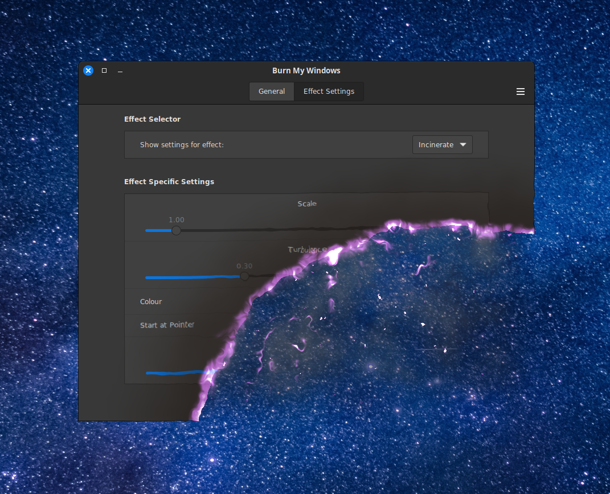

# CinnamonBurnMyWindows

Window open and close effects for the Cinnamon desktop based on the Gnome extension Burn-my-Windows



This is a Cinnamon port of the Gnome extension Burn-my-Windows which can be found here: 

https://github.com/Schneegans/Burn-My-Windows

**Please go to the above link and support their project since this is merely a port of their fine work!**

## Requirements

Cinnamon 6.2 (Mint 22) or better. 

This extension needs the Cinnamon.GLSLEffect class which is only available in Cinnamon 6.2. I had attempted to work around this issue in order to support older versions of Cinnamon but so far I have not been successful.

## Known issues

In the setting configure window under the "Effect Settings" tab, when changing the "Show setting for effect" drop-down to select a different effect, sometimes the contents under the "Effect Specific Settings" title will not properly update. Because of this only a subset of the available options are visible. I believe this is a Cinnamon bug. You can force Cinnamon to properly redraw the options by selecting the "General" tab then selecting the "Effect Settings" tab again. After that, the complete set of "Effect Specific Settings" should be visible.

When closing the Steam Client "setting" window the 'close window effect' does not show the windows contents, resulting in the closing effect to show where the window had existed but otherwise has no negative effect.

Starting VirtualBox shows a full screen animation of both the Open and Close effect even when the window is not starting maximized. I assume this is caused by some weirdness with how VirtualBox was written.

The Doom effect seems to finish animating at a noticeably lower position than where the window actually is located. This results in the sudden jump up after the animation is completed.

All open window effects seem to animate in a location that is one pixel off in both x and y location from the windows real location. This causes a very small (nearly unnoticeable) jump of the window after the animation has finished.

The window shadows are not part of the animation and therefore they suddenly appear right after the animation completes.

### Currently these effects are working in Cinnamon:

- Apparition
- Doom
- Energize A
- Energize B
- Glide
- Glitch
- Hexagon
- Incinerate
- Pixelate
- Pixel Wheel
- Pixel Wipe
- Portal
- TV Effect
- TV Glitch
- Wisps

### Effects currently disabled:

Because Cinnamon is missing a required API, the following effects are disabled. I am hoping to find a way around this issue:

- Broken Glass
- Fire
- Matrix
- PaintBrush
- Snap Of Disintegration
- TRex Attack

## Possible future enhancements

- Specifying effects that can apply to specific application windows. i.e Selecting which effect occurs when closing Firefox.

## Installation

At some point I will submit this extension to cinnamon-spices so you can install it directly from the desktop, but for now you need to manually install using these instructions:

1. Clone the repo (or Download the latest repo by clinking on the green "code" button above then click "Download ZIP")
    ```
    git clone git@github.com:klangman/CinnamonBurnMyWindows.git
    ```
2. If you downloaded a ZIP, decompress the zip into a directory of your choice
    ```
    unzip ~/Downloads/CinnamonBurnMyWindows-main.zip
    ```
3. Change directory to the cloned repo or the decompressed ZIP file
4. Link the "CinnamonBurnMyWindows@klangman" directory into the "~/.local/share/cinnamon/extensions/" directory
    ```
    ln -s $PWD/CinnamonBurnMyWindows@klangman ~/.local/share/cinnamon/extensions/CinnamonBurnMyWindows@klangman
    ```
5. Open the Cinnamon Extensions application (Menu->Preferences->Extensions)
6. Select the "Burn My Windows" entry and then click the "+" button at the bottom of the Extensions window
7. Use the "gears" icon to open the CinnamonBurnMyWindows setting window and setup your preferred behaviour

## Feedback

Feel free to create an issue here on Github to give me feedback or to report any issues you find. 
**Please DO NOT open any issues against the original Gnome project. Open an issue here so I can check if the issue has anything to do with my changes to support Cinnamon**

If you like this extension, please consider making a donation to the author of the original Gnome extension which makes up the vast majority of the code for this Cinnamon extension. Donation links can be found on his Github page:
 
https://github.com/Schneegans/Burn-My-Windows

If you want to help others find this Cinnamon extension, consider staring it so that more people might learn of it's existence.
Also, the more stars it gets the more encouragement I'll have to continue working on it.
Thanks!
